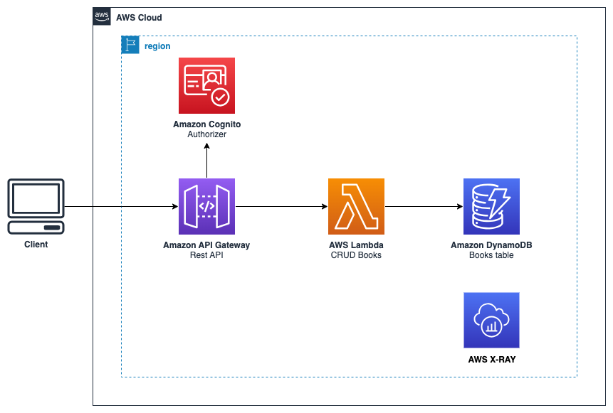

# Api Gateway Demo
This demo project exemplifies a Books REST API with serverless services, such as Api Gateway, using lambda proxy integration and raw code with AWS Lambda and Amazon DynamoDB.

- **Books Application** is implemented with these features
  - Create Book: The Api Gateway receives the request with the authorization token and the new book information in the body, calls a lambda function, and maintains it in Amazon DynamoDB
  - Get Books: The Api Gateway triggers the AWS Lambda function and runs a query on the DynamoDB book table to get all books.

## Reference Architecture


# Requirement

https://docs.aws.amazon.com/cdk/v2/guide/work-with-cdk-python.html

# Project Deployment

## Project Deployment
1. Download the sample project
    ```bash
    git clone https://github.com/letdorne/api_gateway_demo
    ```
2. Access the created directory
    ```bash
    cd api_gateway_demo
    ```
3. Export to variables or change de os.env to your values (CDK_DEFAULT_ACCOUNT, CDK_DEFAULT_REGION) on the file app.py
    ```bash
    export CDK_DEFAULT_ACCOUNT={your_account_id}
    export CDK_DEFAULT_REGION={your_region}
    ```

4. Run this two commands
    ```bash
    cdk synth
    cdk deploy
    ```
6. API endpoint will be returned on the outputs 
    ```bash
    Outputs:
    ApiGatewayDemoStack.XXXXXXXXX = https://XXXXXXXXX.execute-api.{region}.amazonaws.com/dev/
    ```   
7. To test your API GET method get the endpoint returned on outputs and include the resource at the end of the url 
    ```bash
    Paste this url on the browser to text the GET method https://XXXXXXXXX.execute-api.{region}.amazonaws.com/dev/books
    ```   
5. Register a cognito user to use POST method, you can create on console your user or using this aws cli commands:
    ```bash
    aws cognito-idp sign-up --region {your-aws-region} --client-id {your-client-id} --username {your-email} --password {your-password}
    ```

6. Confirm your cognito user registration the user-pool-id value is on outputs 
    ```bash
      aws cognito-idp admin-confirm-sign-up --region {your-aws-region} --user-pool-id {user-pool-id} --username {your-email}
    ```

7. Create a auth.json file with like this example
    ```json
    {
    "UserPoolId": "{your-user-pool-id}",
    "ClientId": "{your-client-id}",
    "AuthFlow": "ADMIN_NO_SRP_AUTH",
    "AuthParameters": {
        "USERNAME": "admin@example.com",
        "PASSWORD": "password123"
    }}
    ```
    
8. To GET the token IdToken to authenticate your API POST method you can run this command
    ```bash
      aws cognito-idp admin-initiate-auth --region {region} --cli-input-json file://auth.json
    ```

9. To test your POST method you can use the API test console, curl, app postman or another app of your choice
- You need to put the header Authorization and the IdToken you you got on step 8
(resources/authorizer-postman.png)

- To the body you can use this example 
    ```json
    {
    "id": 1,
    "name": "MyFirstBook",
    "language": "English",
    "author": "Jane Do"
    }
    ```
- Your return must be like this:
    ```json
    {"Operation": "SAVE",
    "Message": "SUCCESS",
    "Item": {
        "id": 1,
        "name": "MyFirstBook",
        "language": "English",
        "author": "Jane Do"
        }}
    ```
10. Test your GET method again and the return must be like this
(resources/get-api-postman.png)

11. Go to x-ray to see your API service map

## Useful CDK commands

 * `cdk ls`          list all stacks in the app
 * `cdk synth`       emits the synthesized CloudFormation template
 * `cdk deploy`      deploy this stack to your default AWS account/region
 * `cdk diff`        compare deployed stack with current state
 * `cdk docs`        open CDK documentation
