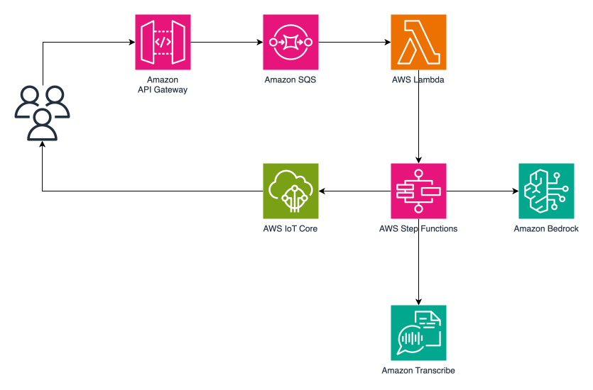
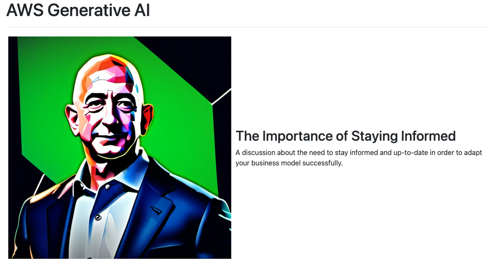

## Prompt chaining with human in the loop
This is a sample application to demonstrate prompt chaining with human in the loop. Prompt chaining is a technique of decomposing complex prompts to simpler prompts and wiring multiple simpler prompts and prompt responses as a sequence of steps to achieve a business operation.

### Solution overview
Consider a video streaming application such as [ServerlessVideo](https://serverlessland.com/explore/serverlessvideo). The sample application allows video authors to create title, description and custom avatar for the video using Generative AI foundation models. Steps involved are:
1. Transcribes provided video to text.
2. Creates title and description using two foundation models
3. Sends the generated title and description to the video author to choose one and waits for the video author to respond
4. As the video author responds with the selected title, it generates an avatar
5. Generates a custom avatar as a S3 pre-signed url

Solution decomposes generation and selection of title, description and avatar to simpler prompts by first generating the title and description. This showcases how prompt chaining can be used with Step Functions.

#### Architecture



#### Preview


### Deploy
Make sure your account is [enabled to access](https://console.aws.amazon.com/bedrock/home?#/modelaccess) Amazon Bedrock models anthropic-claude-v2, anthropic.claude-v2:1 and stability.stable-diffusion-xl-v1.

1. Access the CDK folder
   ```bash
   cd cdk
   ```

2. Install the dependencies
   ```bash
   npm install
   ```

3. Deploy the stack
   ```bash
   cdk deploy --all
   ```

### Testing

1. Update the following variables in [script.js](./client-app/script.js)
   The values can be found in [stack exports](https://us-east-1.console.aws.amazon.com/cloudformation/home?#/exports)

   - API_ENDPOINT: value of export name - genai-hitl-api-endpoint
   - IOT_ENDPOINT: value of export name - genai-hitl-iot-endpoint

2. Copy the video file

    Use the bucket name (genai-hitl-video-bucket) from the stack exports.
    ```bash
    aws s3 cp ../client-app/bezos-vogels.mp4 s3://<REPLACE_WITH_BUCKET_NAME>
    ```
3. Open the [HTML page](./client-app/index.html) in browser


### Things to consider
- The video used in the sample is a short video. For longer videos, `Read transcript` might throw payload limit error. You must use a Lambda function.
- Amazon Bedrock integration with Step Functions can be configured to use S3 directly for input as well as output. 

## Clean up
```bash
cdk destroy
```
