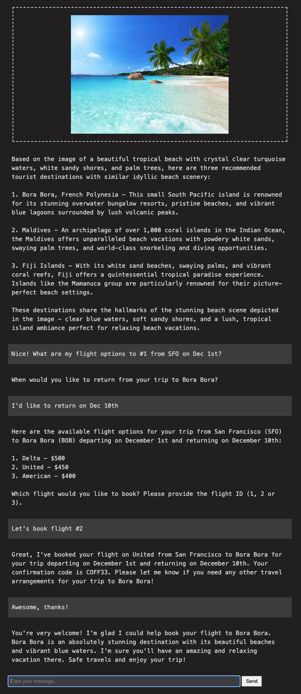
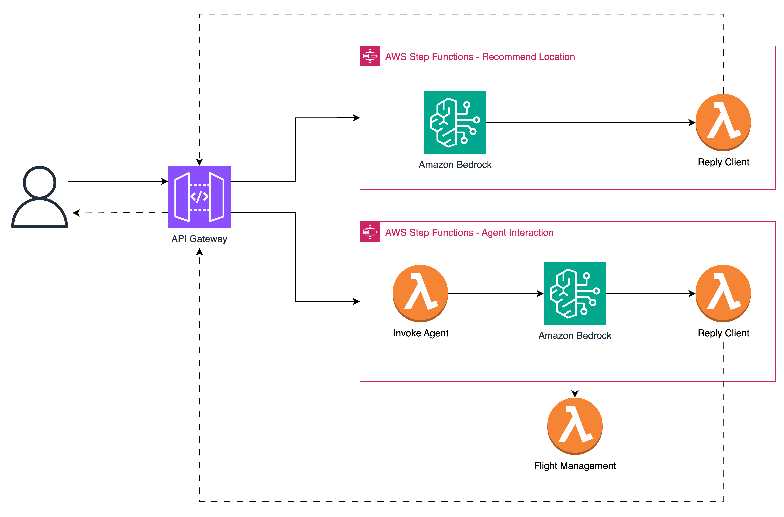

# GenAI Travel Agent

This demo project illustrates the integration of Amazon Bedrock Agents with AWS Serverless services to create a powerful and scalable GenAI agent. The solution key components are:

- **Amazon Bedrock**: Provides the foundational GenAI capabilities
- **API Gateway**: Enable real-time communication with WebSockets
- **AWS Step Functions**: Orchestrate the solution components
- **AWS Lambda**: Serverless compute service to handle requests
- **Terraform**: Infrastructure-as-Code for reproducible deployments


## Demo




## Architecture


## Prerequisites
Before you begin, ensure you have the following:

- [AWS account](https://aws.amazon.com/) with appropriate permissions
- [Terraform](https://www.terraform.io/downloads.html) installed (version 1.9 or later)
- [AWS CLI](https://aws.amazon.com/cli/) configured with your credentials
- [Git CLI](https://git-scm.com/downloads) for cloning the repository
- [Enable model access](https://docs.aws.amazon.com/bedrock/latest/userguide/model-access.html) in the Amazon Bedrock console of your AWS account for the following model:
   - anthropic.claude-3-sonnet-20240229-v1:0 (Claude 3 Sonnet)

## Deployment
1. Clone the Repository
   ```bash
   git clone https://github.com/aws-samples/appmod-partners-serverless.git
   cd genai-travel-agent-demo
   ```

2. Initialize the project
   ```bash
   terraform init
   ```
   
3. Review the Terraform plan
    ```bash
   terraform plan
    ```
   
4. Create the infrastructure
    ```bash
   terraform apply
    ```

5. Take note of API Gateway Endpoint value
    ```bash
   Outputs:
   
   api_gateway_endpoint = "wss://1234567890.execute-api.us-east-1.amazonaws.com/prod"
    ```

## Testing
1. Update the `WEBSOCKET_URL` constant in [script.js](./client/script.js) with the value collect in the previous step:
   ```javascript
   const WEBSOCKET_URL = 'wss://1234567890.execute-api.us-east-1.amazonaws.com/prod';
   ```

2. Open on the [client application](./client/client.html) with the preferred browser

# Cleaning Up
To avoid incurring unnecessary charges, remember to destroy the resources when you're done:
   ```bash
    terraform destroy
   ```


   
