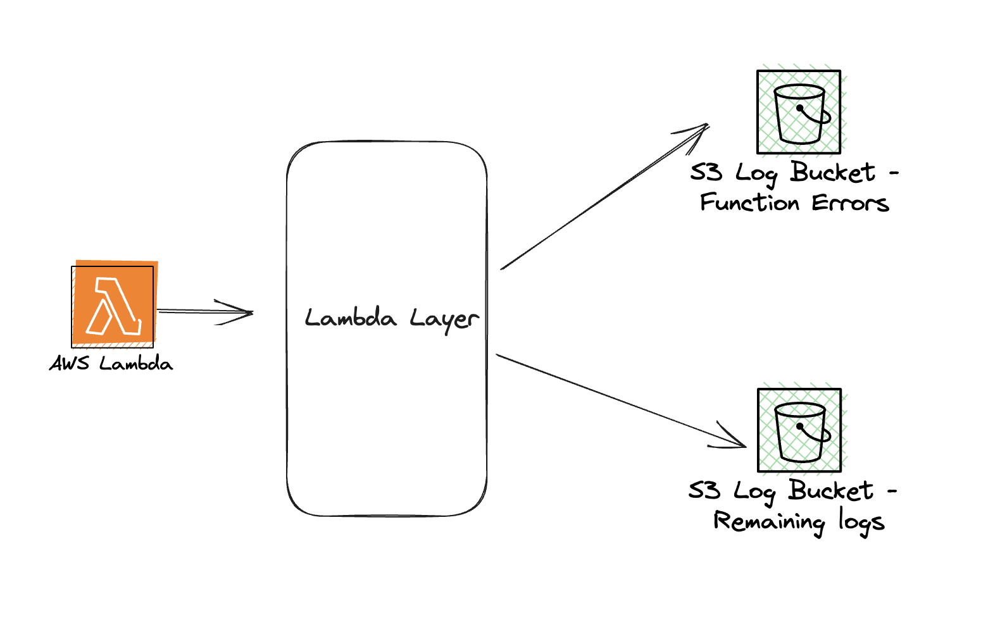

# Lambda Extensions Demo

This is a demo of a sample logging functionality available with [AWS Lambda](https://aws.amazon.com/lambda/) Extensions to send logs directly from Lambda to [Amazon Simple Storage Service (S3)](https://aws.amazon.com/s3/).

Using AWS Lambda Extensions, you can get granular insights into your Lambda function's performance and receive log streams directly from within the Lambda execution environment, making it easier to perform diagnostics and troubleshooting. In this example, you will attach a Lambda extension delivered as a layer to your sample Lambda function. The example creates two S3 buckets to store the logs, one to store only function errors and another to store all other logs. This allows you to query and troubleshoot all your function errors from a dedicated S3 bucket. You can configure SNS on the S3 bucket to receive notifications.

For more information on the extensions logs functionality, see the blog post [Using AWS Lambda extensions to send logs to custom destinations](https://aws.amazon.com/blogs/compute/using-aws-lambda-extensions-to-send-logs-to-custom-destinations/)

# Reference Architecture Diagram



## Requirements

* [AWS SAM CLI ](https://docs.aws.amazon.com/serverless-application-model/latest/developerguide/serverless-sam-cli-install.html) - **minimum version 0.48**.

## Project Deployment

1. [Create an AWS account](https://portal.aws.amazon.com/gp/aws/developer/registration/index.html) if you do not already have one and login.

2. Clone the repo onto your local development machine:
```bash
git clone https://github.com/aws-samples/appmod-partners-serverless
```

3. Access the directory 
```bash
cd lambda-extensions-demo
```

4. Run the following command for AWS SAM to deploy the components as specified in the `template.yml` file:
```bash
sam build
# If you receive build errors or don't have 'Python' or 'make' installed, you can use the option to build using a container which uses a python3.8 Docker container image.  
# sam build --use-container
sam deploy --stack-name lambda-extensions-demo --guided
```

5. During the prompts:

* Accept the default Stack Name `lambda-extension-demo`.
* Enter your preferred Region
* Accept the defaults for the remaining questions.

AWS SAM deploys the application stack which includes the Lambda function and an IAM Role. AWS SAM creates a layer for the runtime, a layer for the extension, and adds them to the function.

Note the names of outputted S3 Buckets.

## Invoke the Lambda function

You can now invoke the Lambda function. 
Navigate to the AWS Lambda console and find the Amend the Region and use the following command:
```bash
aws lambda invoke \
 --function-name "logs-extension-demo-function" \
 --payload '{"payload": "hello"}' /tmp/invoke-result \
 --cli-binary-format raw-in-base64-out \
 --log-type Tail \
 --region <use your Region>
```
The function should return `"StatusCode": 200`

Browse to the [Amazon CloudWatch Console](https://console.aws.amazon.com/cloudwatch). Navigate to *Logs\Log Groups*. Select the log group **/aws/lambda/logs-extension-demo-function**.

View the log stream to see the platform, function, and extensions each logging while they are processing.

The logging extension also receives the log stream directly from Lambda, and copies the logs to S3.

Browse to the [Amazon S3 Console](https://console.aws.amazon.com/S3). Navigate to the S3 bucket created as part of the SAM deployment. 

Downloading the file object containing the copied log stream. The log contains the same platform and function logs, but not the extension logs, as specified during the subscription.

If you receive a `permission denied Extension.LaunchError` in the logs, the extension does not have the neccesary permissions.
Run `chmod +x logs_api_http_extension.py` and build and deploy the AWS SAM application again.
