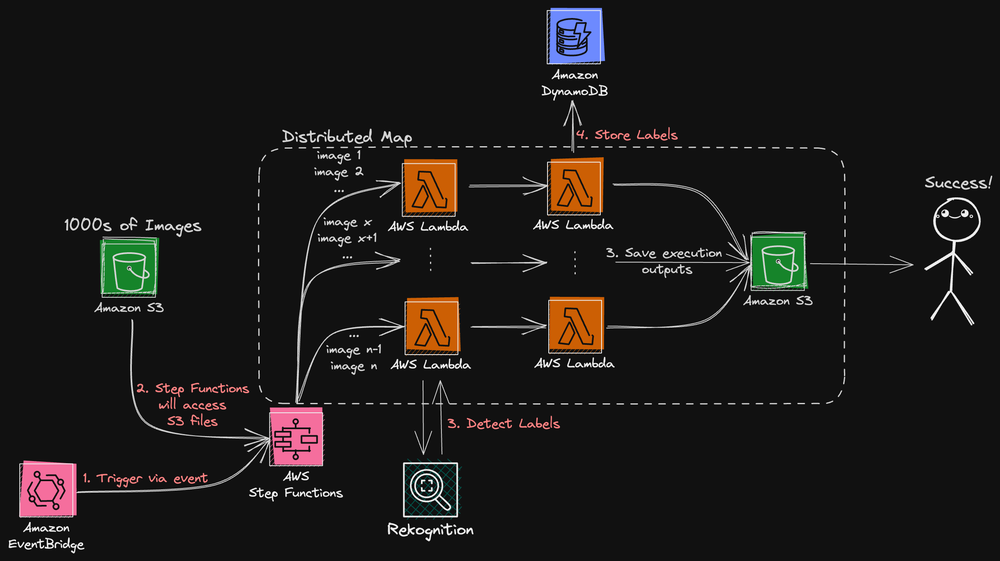

# Serverless Data Processing
This project demonstrates an example pattern for data processing using Serverless compute and integration services.

Using Step Functions Distributed Maps, you can now process high number of images in an S3 bucket for any data processing in parallel. In this example, you will provide an S3 bucket with any number of images, and the workflow will 1/ call Rekognition API to detect labels in the image and then 2/ Process the response and record it as an item in a DynamoDB table.

## Reference Architecture


# Requirement

1. AWS CDK
2. Python 3.10 (if you want to revise the Lambda functions)
3. An existingS3 bucket with a lot of images (either in the main bucket or under a folder)

# Project Deployment

## Project Deployment
1. Clone the repository
    ```bash
    git clone https://github.com/aws-samples/appmod-partners-serverless
    ```
2. Access the directory
    ```bash
    cd serverless-data-processing
    ```
3. Export to the following variables in your terminal (If you do not set these, **the stack deploy will fail**.):
    - S3_BUCKET_NAME = Name of the S3 bucket which has your image files.
    - DYNAMODB_TABLE_NAME = Name of the DynamoDB table that will be created to record data.

    ```bash
    export S3_BUCKET_NAME='<name of your existing bucket>'
    export DYNAMODB_TABLE_NAME='<name of the table you want to create>'
    ```
4. Run the CDK commands to deploy the resources:
    ```bash
    cdk synth
    cdk deploy --all
    ```

5. One of the CloudFormation Output is called "DMapStateMachineConsoleUrl". Access that website on your browser (it will be in the form of: "https://<your-region>.console.aws.amazon.com/states/home?region=<your-region>#/statemachine/view/<arn-of-your-state-machine>")

6. Click "Start Execution" and provide the following Input (if your images are in the main S3 bucket, provide "" for the Prefix. Otherwise, provide the actual subfolder within the S3 bucket, i.e. "images" or "data/images"):

```json
    {
    "myStateInput": {
        "Bucket": "<name of your bucket>",
        "Prefix": "<name of your folder>"    
    }

```

7. You will be able to access your execution, along with the Map Run showing the individual child executions.