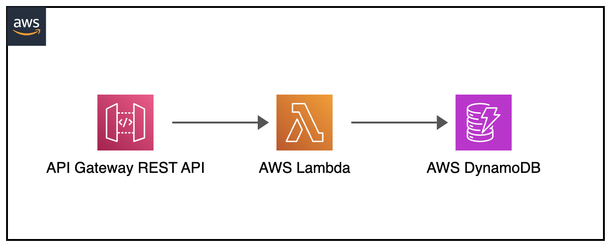

# Serverless Microservice

This is a sample serverless microservice built using Amazon API Gateway, AWS Lambda, and Amazon DynamoDB, all provisioned and managed using Terraform.

## Architecture



The microservice consists of the following components:

1. **API Gateway**: Handles incoming HTTP requests and routes them to the appropriate Lambda function.
2. **Lambda Functions**: Serverless compute functions that implement the business logic of the microservice.
3. **DynamoDB**: A NoSQL database used to store and retrieve data for the microservice.

## Features

- **CRUD Operations**: The microservice supports create, read, update, and delete operations for a specific resource.

## Requirements
 - Terraform
 - AWS CLI

## Usage

To use this microservice, follow these steps:

1. **Deploy the Infrastructure**: Use the provided Terraform configuration to deploy the necessary AWS resources.
2. **Interact with the API**: Make HTTP requests to the API Gateway endpoint to interact with the microservice.

### Terraform Commands

1. **Initialize Terraform**: `terraform init`
2. **Plan the Infrastructure**: `terraform plan -out=tfplan`
3. **Apply the Infrastructure**: `terraform apply tfplan`
4. **Destroy the Infrastructure**: `terraform destroy`

### API Endpoints
 
- `POST /`: Create a new item
- `PUT /`: Update an existing item
- `GET /`: Retrieve all items
- `GET /{id}`: Retrieve an item by ID
- `DELETE /{id}`: Delete an item

_Note: Terraform will provide API endpoint as output in `api_endpoint`._

### Example Requests

Create Item
```http request
POST /
Content-Type: application/json

{
    "name": "Example Item",
    "description": "This is an example item.",
    "price": 9.99
}
```

Update Item
```http request
PUT /
Content-Type: application/json

{
    "id": "c0000000-0000-0000-0000-000000000ffe",
    "name": "Update Example Item",
    "description": "This is an example item.",
    "price": 9.99
}
```

Retrieve All Items
```http request
GET /

[
    {
        "id": "c0000000-0000-0000-0000-000000000ffe"
        "name": "Example Item",
        "description": "This is an example item.",
        "price": 9.99
    },
    {
        "id": "c0000000-0000-0000-0000-000000000fff"
        "name": "Example Another Item",
        "description": "This is an another example item.",
        "price": 99.99
    }
]
```

Retrieve Item
```http request
GET /c0000000-0000-0000-0000-000000000ffe

{
"id": "c0000000-0000-0000-0000-000000000ffe"
"name": "Example Item",
"description": "This is an example item.",
"price": 9.99
}
```

DELETE Item
```http request
DELETE /c0000000-0000-0000-0000-000000000ffe
```

